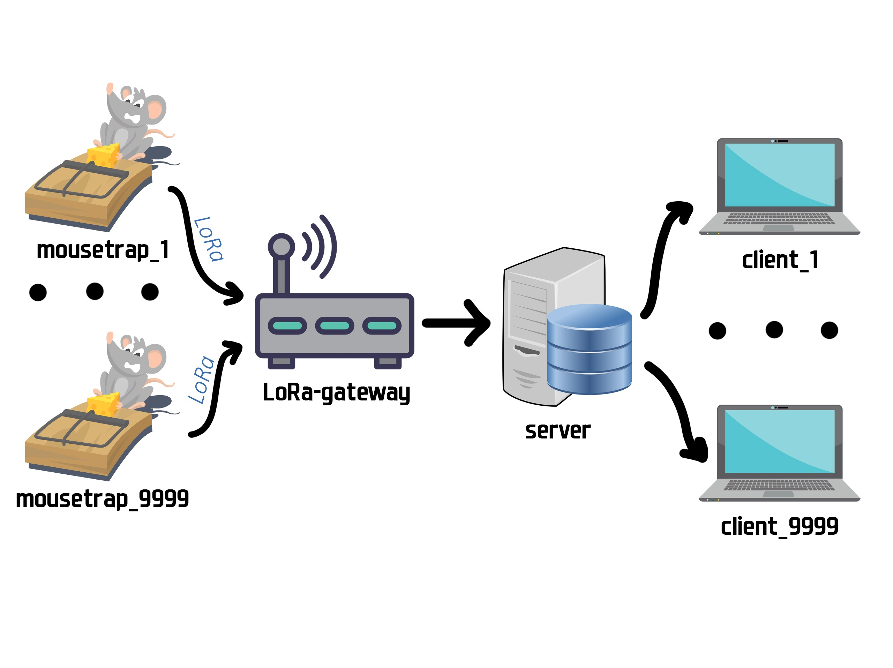

# IOT PROJECT "SMART MOUSETRAP"

[MAIN PAGE](https://smart-mousetrap.herokuapp.com/) 

[SWAGGER DOC](https://smart-mousetrap.herokuapp.com/swagger/index.html)

  

## Архитектура проекта:
### Мышеловка:
- Хранит свое имя, которое задается при первоначальной настройке. Имя уникально для конкретной организации.
- При изменении своего состояния, мышеловка отправляет свое имя и свой статус на базовую станцию, используя технологию LoRa.
### Базовая станция:
- При первоначальной настройке в базовую станцию вносятся имя организации и пароль.
- Во время инициализации базовая станция осуществляет аутентификацию и получает токен для дальнейшего взаимодействия с сервером.
- При получения сообщения от мышеловки базовая станция перенаправляет его на сервер вместе с токеном.
